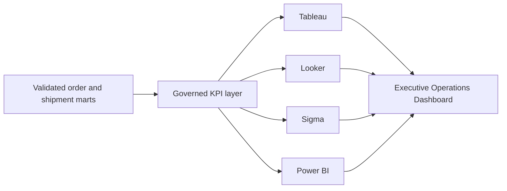

# Tableau BI Dashboard Lab

A governed business-intelligence lab built on validated supply-chain marts. The
repository demonstrates how the same analytical layer can support Tableau,
Looker, Sigma, and Power BI without redefining KPI logic in every tool.

The project is designed as a portfolio lab, not as a claim of a deployed
enterprise BI environment.

## Business Objective

Operations leaders need a single view of:

- service level;
- OTIF;
- fill rate;
- carrier performance;
- warehouse performance;
- cost-to-serve;
- customer-level service and logistics cost.

The lab turns validated order and shipment marts into governed dashboard-ready
exports and tool-specific implementation specifications.

## Architecture



## Repository Contents

- `data/generate_bi_source.py`: deterministic 2,400-order source generator.
- `data/tableau_ready_exports/`: generated dashboard-ready CSV extracts.
- `tableau/`: calculated fields, LODs, table calculations, dashboard wireframes,
  actions, and workbook build instructions.
- `looker/`: actual LookML-style view and model files.
- `sigma/`: workbook construction and self-service governance guidance.
- `powerbi_spec/`: star-schema, DAX, Power Query, RLS, and refresh strategy.
- `governance/`: metric dictionary and semantic-layer rules.
- `validation/`: deterministic export builder, cross-extract reconciliation, tests,
  and generated evidence.
- `governance/metric_lineage.md`: KPI-to-source-to-tool validation ledger.
- `screenshots/`: visual evidence regenerated from the governed extracts.

## Main KPI Results

| KPI | Result |
|---|---:|
| Unit Fill Rate | 98.70% |
| Complete Order Rate | 84.88% |
| On-Time Delivery | 72.75% |
| OTIF | 61.92% |
| Revenue | $22,339,914.98 |
| Logistics Cost | $744,586.62 |

## Skills Demonstrated

- governed KPI design;
- Tableau calculated fields and LOD expressions;
- table calculations and parameter-driven views;
- LookML-style semantic modeling;
- Sigma self-service workbook design;
- Power BI star schema, DAX, Power Query, and RLS;
- SQL-to-dashboard reconciliation;
- stakeholder-oriented dashboard design;
- human-validated AI-assisted BI workflow.

## Quick Validation

```bash
python -m pip install -r requirements.txt
make verify
```

`make verify` rebuilds every derived extract from the canonical order-level
source, reconciles 26 metric and grain contracts, runs six tests, and regenerates
the three visual evidence files.

## Honest Scope

The repository contains Tableau-ready, Looker-style, Sigma-ready, and Power
BI-ready artifacts. It does not include proprietary workbook binaries or claim
a production deployment. Weighted measures are rebuilt from additive numerator
and denominator fields so warehouse, customer, daily, and executive views share
the same governed definitions.
